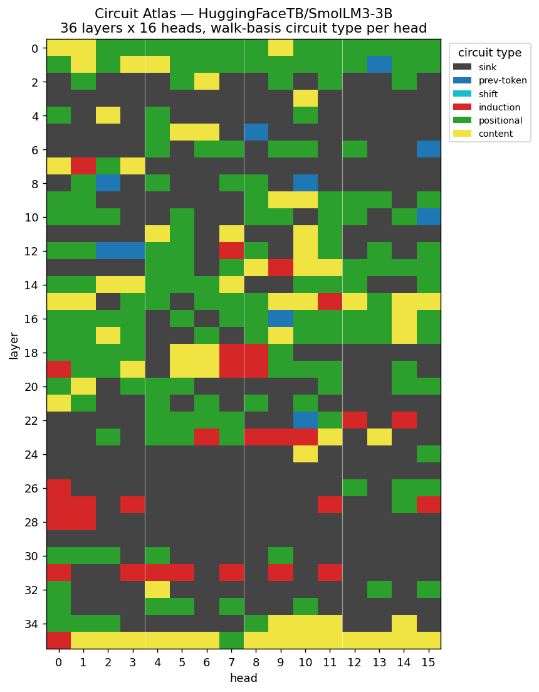
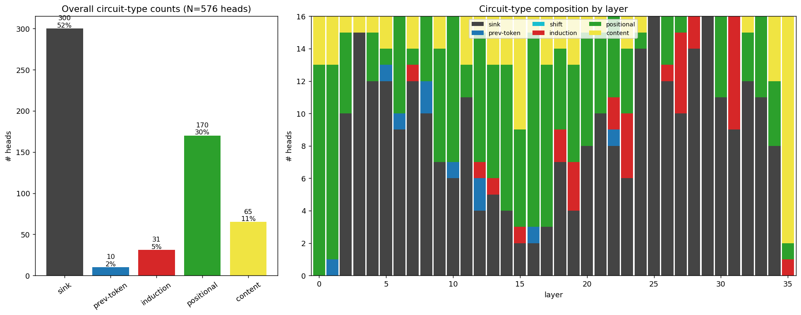
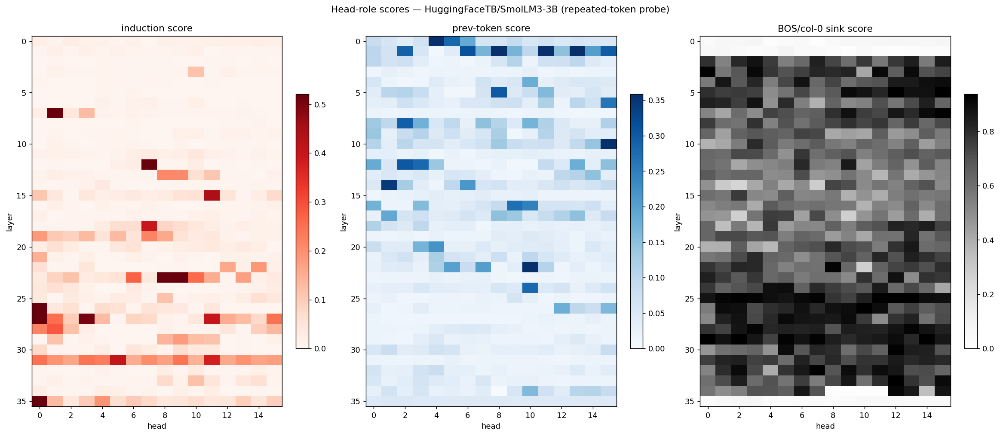
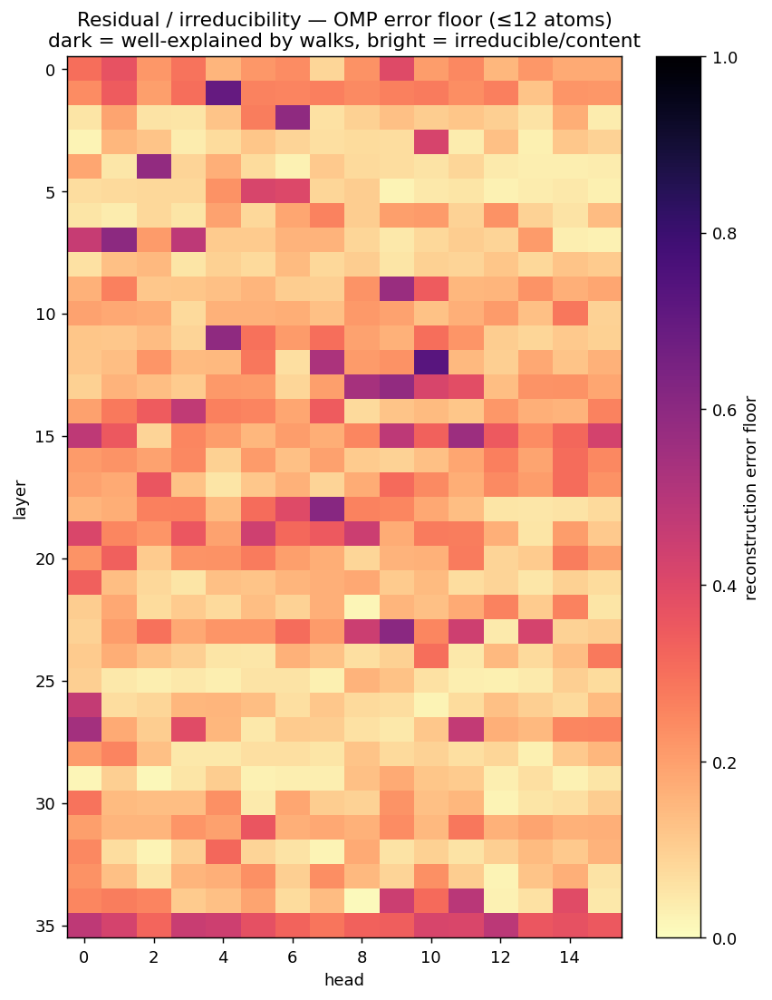

# A dictionary of walks draws a map of a transformer

*A training-free, label-free interpretability lens — and an honest accounting of what's new and what isn't.*

## The one-liner

A fixed dictionary of analytic **walk / diffusion operators**, sparse-coded against each attention head, acts as a **training-free diagnostic basis** that labels a head's circuit-type and **recovers the known transformer layer-anatomy across an entire 3B model** — generalizing canonical-template head detection to an over-complete structured-operator basis.

## What we did (the construction)

1. Build a small, **hand-named dictionary** of canonical attention operators — each one a structured "walk":
   - `shift-k` (previous-token / look-back),
   - `induction-shift` (the content-dependent copy-the-token-after-the-last-occurrence pattern),
   - `cell-uniform` (averaging / bag-of-words),
   - `path-diffusion`, `cycle-diffusion` (heat-kernel / continuous-time-quantum-walk operators on a line / ring),
   - `bos-sink` (the attention-sink-onto-a-special-token pattern).
2. Take a real attention head's pattern matrix `A` and **sparse-code it** against the dictionary (OMP / non-negative LASSO).
3. The **dominant named atom** = the head's circuit-type label. No training. No labels. Just: *which canonical walk is this head closest to?*

## What it found

Pointed at **SmolLM3-3B** — 576 heads it had never seen, no supervision — the dictionary redrew the textbook transformer **from scratch**:

- **Attention-sink phase transition**, discovered cold: layers 0–1 carry ~zero sink mass; it switches on hard at **layer 2** and floods the rest of the network.
- **Induction heads (31 of them)** in the classic **mid-to-late band (L22–L31)**, strongest at 0.93 attention onto the induction target.
- **Positional / prev-token heads cluster early** (L0–1), upstream of the induction band.
- **Final layer goes content** — a sensible output layer.

**The headline figure — every head of SmolLM3-3B, colored by its dominant walk-atom:**

*Two positional rows on top; a grey ocean of attention-sinks switching on hard at layer 2; a red induction band burning through the late layers (L22–31); a yellow content row at the bottom — recovered with no training and no labels.*

*The circuit-type census: sinks dominate the bulk, with positional heads concentrated early and induction heads in the mid-to-late band.*

*Independent score maps (induction / prev-token / sink) — the cross-check that the atom labels track the known behavioral signatures, not just the fit.*

The striking part isn't *that* these phenomena exist — it's that a 22-atom dictionary of **walks** sorts a 3-billion-parameter model into them with the layer-distribution falling out correctly, when **the dictionary contains no information about layers at all.**

## The honest part (this is a lens, not a discovery)

- **The phenomena are known.** Attention sinks (Xiao et al., StreamingLLM), induction heads (Olsson et al.), the previous-token / QK-OV circuit picture (Elhage et al., *A Mathematical Framework for Transformer Circuits*) — all prior art. We did not discover them; we **re-derived their map** with an independent instrument.
- **The method generalizes something that exists.** TransformerLens's `head_detector` already matches head patterns against fixed `previous_token` / `duplicate_token` / `induction` templates. This is that idea, scaled up: an **over-complete, named, structured-operator dictionary** + sparse coding + dominant-atom labeling. The genuinely new ingredient is using **graph-diffusion / continuous-time-quantum-walk / heat-kernel operators** as the interpretability basis — that specific vocabulary doesn't appear in the interp literature.
- **It's a classifier, not a reconstructor.** The named atom is diagnostic of circuit type *even when the fit is loose*. Induction heads pick the right atom (`induction-shift`) but leave a large diffuse residual (~0.37 error). Only ~32% of heads reconstruct tightly (≤0.10 error); 89% get a clean *label*. So: it tells you *what kind of head* this is; it does **not** compress the head.

*The honesty panel: bright = large residual = "right label, not a tight fit." The diagnostic survives where the compression doesn't.*
- **Two caveats worth keeping visible:** attention heads are **polysemantic** (a single head often does several things — Kissane et al. find ≥90% in GPT-2-small), and **pattern-match ≠ causal role** — a proper version would add an ablation/patching check that the atom-label tracks the head's causal function.

## Why "walks"?

The dictionary atoms aren't arbitrary templates — they're operators from a quantum-walk framework (perfect state transfer, mixing, search on graphs) we'd been formalizing in Lean. `path-diffusion` is a continuous-time quantum walk on a line; `cell-uniform` is the equitable-partition quotient; `shift` is a translation on a cycle. So the "lens" is: *what if attention heads are (approximately) simple walks on small graphs?* For positional heads, they genuinely are. For content heads, they aren't — and that "aren't" is itself a measurable, certified statement (those heads are irreducible to this basis).

## TL;DR

A fixed dictionary of **walk operators** + sparse coding = a free, label-free **circuit-type classifier** for attention heads that reproduces the known anatomy of a real 3B LLM. It's an honest *lens* (generalizing `head_detector` with CTQW/diffusion atoms), not a new finding, and it's a classifier rather than a compressor. The map a dictionary of walks drew turned out to be a transformer.

---

## Thread version (for posting)

1/ took a fixed dictionary of ~22 named "walk" operators — shift, induction-shift, averaging, path/cycle diffusion, attention-sink — and sparse-coded every attention head of SmolLM3-3B against it. no training, no labels. just: *which canonical walk is this head closest to?*

2/ it redrew the transformer from scratch. the attention-sink phase transition (off in L0–1, ON at L2), the induction-head band in the mid-late layers (31 of them), prev-token heads early, content heads at the end. [atlas figure]

3/ the wild part: the dictionary has zero information about layers. yet the layer-distribution of circuit types falls out correctly. a 22-atom basis of walks sorts a 3B model into its known anatomy.

4/ honesty, because it matters: the *phenomena* are all known — attention sinks (Xiao/StreamingLLM), induction heads (Olsson), the circuit framework (Elhage). i didn't discover them. i re-derived their map with an independent instrument.

5/ and the *method* generalizes TransformerLens `head_detector` (fixed-template head matching) to an over-complete, named, structured-operator dictionary. the new ingredient is using quantum-walk / heat-kernel operators as the interp basis — that vocabulary isn't in the interp literature afaik.

6/ big caveat: it's a CLASSIFIER, not a reconstructor. induction heads pick the right atom but leave a fat residual (~0.37). 89% get a clean label, only 32% fit tightly. it tells you what *kind* of head, it doesn't compress it. (also: heads are polysemantic; pattern ≠ causal role.)

7/ where it comes from: a quantum-walk framework (perfect state transfer / mixing / search on graphs, formalized in Lean). the atoms are literally CTQW operators. the question was "are attention heads simple walks on small graphs?" — positional heads genuinely are; content heads genuinely aren't, and *that's a certified statement*.

8/ so: a free, label-free circuit-type lens that reproduces a real LLM's anatomy. a new lens, not a new finding. the map a dictionary of walks drew turned out to be a transformer. ( ◕‿◕ )
